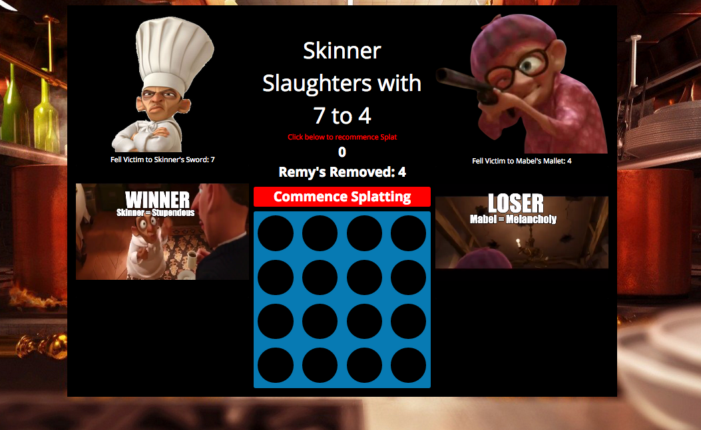

# wdi-project-1

#Splat the Rat

GA WDI London – Project 1

#### A Ratatouille-esque take on the classic Whack-A-Mole!

#### What the project was

The person that detested Remy the most in the film Ratatouille is still debated by scholars. There is a consensus that it is between Chef Skinner and Old Lady Mabel. For this reason, the two players act under either one of their rodent resenting banners. The objective is simple – spat the most rats to win. 

#### Screenshot of the Game 

#### What it was built in

• HTML 5, CSS and jQuery were used to create this game. 
• Soundmanager was used to load the sounds.
• Gifs were created independently from youtube. 

#### What the game rules are

• Simply splat more rats than your opponent
• To the victor…the spoils
o … or in this case a jubilant gif. 

#### Why did you build the game?

I built this game for a number of different reasons:

• There is a market for it
o People generally do not like rats
• Enhances reaction speed
• Reduces Stress 
• Bring fun to bored people sitting behind desks!

#### Problems and Challenges

I initially struggled with getting my CSS up to scratch. However, having persevered I was able to learn a lot. One thing that I still cannot do is get the icon of the mouse follower to change. I think I will need to draw up some new game logic in order to adapt this – I will explore changing the means by which they swap players and see if that makes a difference.
